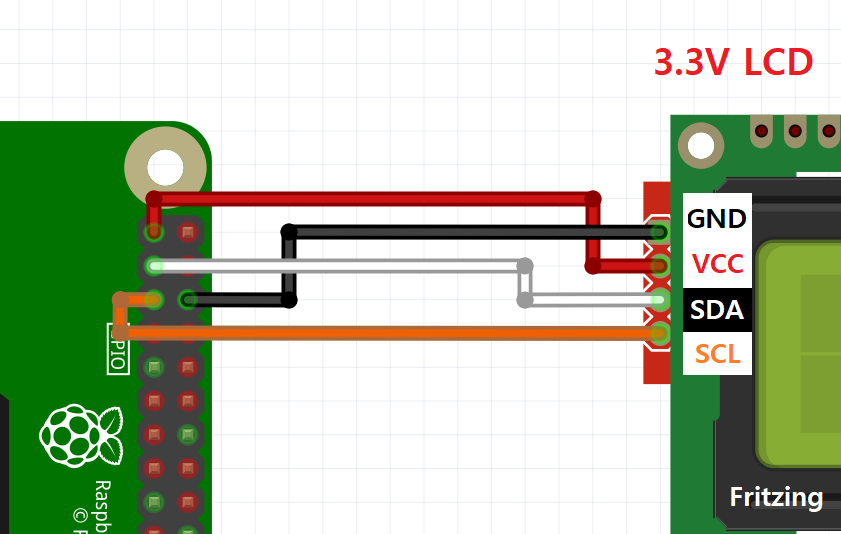
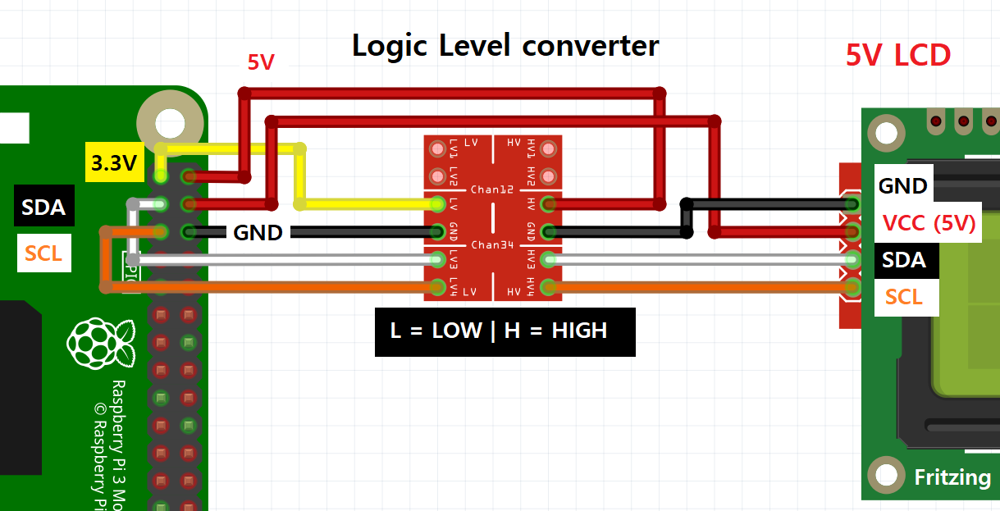

# RPi_I2C_LCD_driver  

## Raspberry Pi I2C LCD 모듈 Python 라이브러리  

I2C (1602) LCD 모듈을  Raspberry PI에서 [Arduino LiquidCrystal_I2C](https://www.arduino.cc/en/Reference/LiquidCrystal)라이브러리와 유사하게 사용할 수 있는 라이브러리 파일 입니다.  

단, 언어의 차이점 부분은 고려해 주어야 합니다.  
아두이노 - LiquidCrystal  C C++  
라즈베리파이 - RPi_I2C_LCD_driver  Python  

- 관련 제품  
[LCD 1602 llC I2C모듈(5V)](https://www.eleparts.co.kr/EPXHVBKK)  
[5V-3.3V Logic Level converter](https://www.eleparts.co.kr/EPXMRWTR)  
  
## 필수 설정 & 설치 라이브러리  

- Raspberry Pi Configuration -> Enable I2C  
라즈베리파이 설정에서 I2C를 꼭 Enable해 주어야 합니다.  

> sudo apt-get install python-smbus  
> sudo apt-get install python3-smbus  

smbus를 사용할 파이썬 버전에 맞춰 설치해 줍니다.  

- I2C adress 확인 명령어 - LCD연결 후 확인 가능  

> i2cdetect -y 1  
  
  
### start.sh  

별도의 라이브러리 등록 과정 없이 예제코드(example)를 실행하기 위해 드라이버 파일을 각 디렉토리에 복사해 줍니다  
(라이브러리 등록을 할 경우 실행할 필요가 없습니다.)  
  
> chmod +x start.sh  
> ./start.sh  
  
  
## 회로 구성  
  
### 3.3V LCD 직접 연결  
  
  
  
### 5V LCD Level converter 이용하여 연결  
  
  
  
  
## 함수 설명  

- LiquidCrystal()  
사용되지 않음, 클래스 정의시 자동으로 초기화 + I2C 방식으로 address 입력 (기본값 0x27)  

> lcd = RPi_I2C_driver.lcd(0x27)  

- begin()  
사용되지 않음, 클래스 정의시 자동으로 초기화, 아래와 같이 추가 옵션 입력 가능 (기본값 0x27, 1602 size)  

> lcd = RPi_I2C_driver.lcd(0x27, 16, 2)  

- clear()  
LCD의 내용을 전부 지우고 커서 위치 초기화  

- home()  
커서 위치 0,0으로 초기화  

- setCursor(col, row)  
커서 위치 이동  

- write(hex_data, delay)  
LCD에 문자 출력  
int 타입 입력 시 ROM에서 해당하는 문자 출력  

- print(str(char)_data, delay)  
LCD에 문자문자열 출력  
int 타입 입력 시 숫자(DEX10진수)를 그대로(문자열) 출력  

- cursor()  
밑줄 커서 켜기  

- noCursor()  
밑줄 커서 끄기  

- blink()  
깜박이는 (하얀 박스) 커서 켜기  

- noBlink()  
깜박이는 (하얀 박스) 커서 끄기  

- display()  
noDisplay()로 끈 LCD를 다시 켭니다.  
(noDisplay()로 사라진 글자가 남아있습니다.)  

- noDisplay()  
현재 텍스트를 보존한 상태로 LCD 끄기  
(현재 출력되어있는 글자는 남아있습니다.)  

- scrollDisplayLeft()  
디스플레이 내용 (텍스트 및 커서)을 한 칸 왼쪽으로 스크롤합니다.  

- scrollDisplayRight()  
디스플레이 내용 (텍스트 및 커서)을 한 칸 오른쪽으로 스크롤합니다.  

- autoscroll()  
LCD의 자동 스크롤을 켭니다. 이렇게하면 각 문자 출력이 디스플레이로 이동하여 이전 문자를 한 칸 넘게 밀어 넣을 수 있습니다.  
현재 텍스트 방향이 왼쪽에서 오른쪽 (기본값)이면 디스플레이가 왼쪽으로 스크롤됩니다.  
현재 방향이 오른쪽에서 왼쪽이면 디스플레이가 오른쪽으로 스크롤됩니다.  
이것은 새로운 문자를 LCD의 같은 위치에 출력하는 효과가 있습니다.  

- noAutoscroll()  
LCD의 자동 스크롤을 끕니다.  

- leftToRight()  
LCD에 쓰여지는 텍스트의 방향을 왼쪽에서 오른쪽, 기본값으로 설정하십시오.  
즉, 디스플레이에 쓰여진 후속 문자는 왼쪽에서 오른쪽으로 이동하지만 이전에 출력 된 텍스트에는 영향을 미치지 않습니다.  

- rightToLeft()  
LCD에 쓰여지는 텍스트의 방향을 오른쪽에서 왼쪽으로 설정하십시오 (기본값은 왼쪽에서 오른쪽입니다).  
즉, 디스플레이에 쓰여진 후속 문자는 오른쪽에서 왼쪽으로 이동하지만 이전에 출력 된 텍스트에는 영향을 미치지 않습니다.  

- createChar()  
사용자 정의 문자를 작성합니다.  
최대 8자, 5x8을 지원합니다.  
